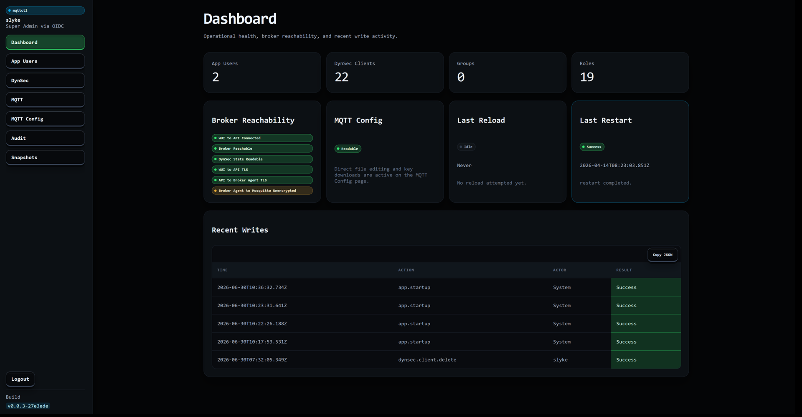
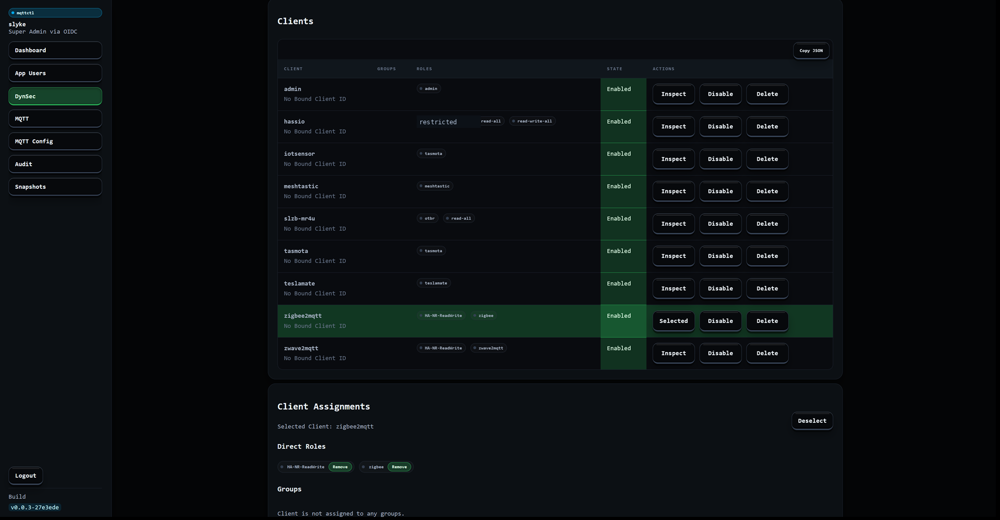
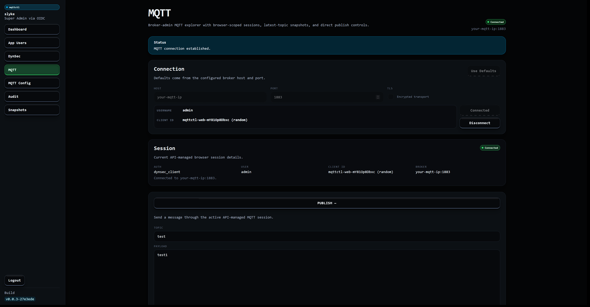
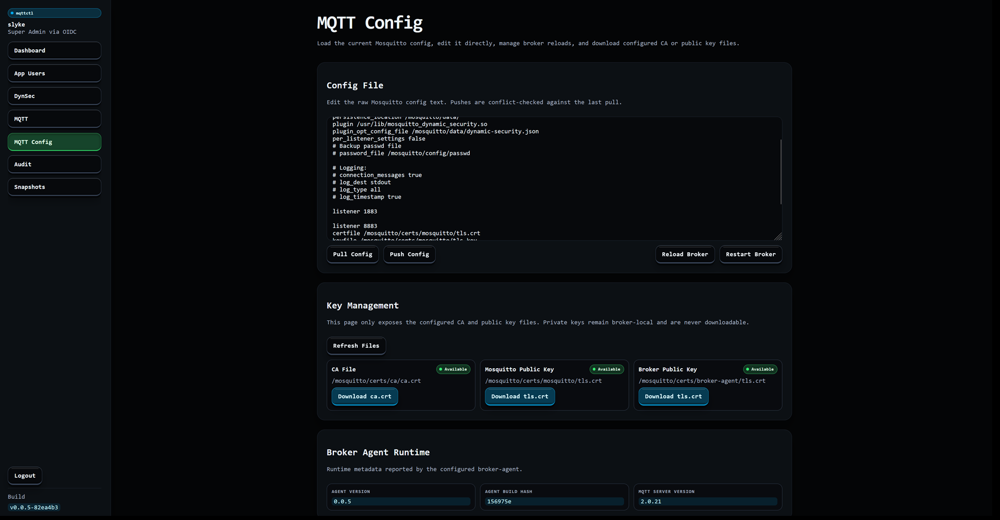

# mqttctl

Run, secure, and troubleshoot Mosquitto from one local-first control plane.

`mqttctl` gives you a browser UI for DynSec, raw broker config, audit history, snapshots, and live MQTT debugging, without assuming shell access to the broker host.

## Screenshots

<p>
  <a href="./docs/images/1_dashboard.png"></a>
  <a href="./docs/images/4_dynsec_clients.png"></a>
</p>
<p>
  <a href="./docs/images/11_mqtt_connected.png"></a>
  <a href="./docs/images/13_mqtt_config.png"></a>
</p>

Full gallery: [Dashboard](./docs/images/1_dashboard.png), [App Users](./docs/images/2_app_users.png), [DynSec Overview](./docs/images/3_dynsec_top.png), [DynSec Clients](./docs/images/4_dynsec_clients.png), [Client Assignments](./docs/images/5_dynsec_client_assignments.png), [Effective Permissions](./docs/images/6_dynsec_effective_permissions.png), [DynSec Roles](./docs/images/7_dynsec_roles.png), [ACLs and Groups](./docs/images/8_dynsec_acls_groups.png), [ACL Options](./docs/images/9_dynsec_acl_options.png), [MQTT Connection](./docs/images/10_mqtt_connection_options.png), [MQTT Connected Session](./docs/images/11_mqtt_connected.png), [MQTT Subscriptions](./docs/images/12_mqtt_subscriptions.png), [MQTT Config](./docs/images/13_mqtt_config.png), [Audit Log](./docs/images/14_audit.png), [Audit Entry Modal](./docs/images/15_audit_modal.png), [Snapshots](./docs/images/16_snapshots.png).

## What The App Does Today

- Dashboard: live diagnostics, transport security badges, DynSec bootstrap status, counts, and recent audit activity
- Audit: append-only history for writes, app startup, and login outcomes, limit presets, and JSON export with chained SHA-256 integrity metadata
- DynSec: clients, groups, roles, ACLs, effective-permissions view, default-role management, and clean-start bootstrap of `read-all` plus `read-write-all`
- MQTT Config: raw broker-config pull or push, explicit reload or restart actions, and managed CA or public key downloads
- MQTT Explorer: session-scoped MQTT connect, subscribe, publish, latest-topic tracking, and SSE-backed live updates
- Snapshots: JSON export for dynsec, broker config, or combined data, plus import preview and broker-config apply
- Auth and RBAC: local auth, OIDC, or trusted headers, with DB-backed sessions and server-side authorization on mutations

## Documentation Map

- [`docs/getting-started.md`](./docs/getting-started.md): quick guides for getting the stack running, choosing auth, wiring TLS, and first-use flows
- [`docs/advanced-operations.md`](./docs/advanced-operations.md): detailed runtime, auth, broker-agent, DynSec, MQTT explorer, snapshots, and logging behavior
- [`docs/backup-restore.md`](./docs/backup-restore.md): SQLite and Postgres backup or restore runbooks for app data and broker runtime files
- [`docs/development.md`](./docs/development.md): contributor workflow, local dev commands, tests, and bind-mounted dev stack notes
- [`docs/images/`](./docs/images): screenshot assets used by this README
- [`docs/CERTS.md`](./docs/CERTS.md): TLS walkthrough for Mosquitto, broker-agent HTTPS, and compose-mounted cert files
- [`docs/spec.md`](./docs/spec.md): current product and technical contract
- [`AGENTS.md`](./AGENTS.md): repo-wide rules and documentation maintenance expectations
- [`mqttctl/AGENTS.md`](./mqttctl/AGENTS.md), [`mqttctl/mqttctl-api/AGENTS.md`](./mqttctl/mqttctl-api/AGENTS.md), [`mqttctl/mqttctl-fe/AGENTS.md`](./mqttctl/mqttctl-fe/AGENTS.md), [`broker-agent/AGENTS.md`](./broker-agent/AGENTS.md): package-level boundaries

## Quick Start

### Docker Compose + Local Auth

Copy the local-auth samples into the filenames that compose actually mounts:

```bash
cp config/compose/gui-api/mqttctl.config.example-localauth.json5 config/compose/gui-api/mqttctl.config.json5
cp config/compose/gui-api/mqttctl.secrets.example-localauth.json5 config/compose/gui-api/mqttctl.secrets.json5
docker compose up --build
```

Then open `http://localhost:3000` and sign in with the bootstrap credentials you placed in `config/compose/gui-api/mqttctl.secrets.json5`. The checked-in defaults live in [`config/compose/gui-api/mqttctl.secrets.example-localauth.json5`](./config/compose/gui-api/mqttctl.secrets.example-localauth.json5).

### Common Next Steps

- OIDC: start from [`config/compose/gui-api/mqttctl.config.example-oidc-localauth.json5`](./config/compose/gui-api/mqttctl.config.example-oidc-localauth.json5) and [`config/compose/gui-api/mqttctl.secrets.example-oidc.json5`](./config/compose/gui-api/mqttctl.secrets.example-oidc.json5), then restart the app
- Trusted-header auth: add `auth.headerEnabled`, `auth.header.trustedCidrs`, `auth.header.usernameHeader`, and `auth.header.defaultRole`; details are in [`docs/getting-started.md`](./docs/getting-started.md)
- TLS for Mosquitto or broker-agent HTTPS: follow [`docs/CERTS.md`](./docs/CERTS.md)

## Runtime Model

- The control plane reads exactly two JSON5 files at startup:
  - `MQTTCTL_CONFIG_PATH`
  - `MQTTCTL_SECRETS_PATH`
- The broker-agent reads one JSON file at startup:
  - `MQTTCTL_BROKER_AGENT_CONFIG_PATH`
- Those runtime files are bootstrap-only inputs:
  - the app treats them as read-only
  - changes require a process restart to take effect
- SQLite is the default DB mode:
  - `MQTTCTL_DB_KIND=sqlite`
  - `MQTTCTL_SQLITE_PATH=/path/to/mqttctl.sqlite`
- Postgres is optional:
  - set `MQTTCTL_DB_KIND=postgres`
  - keep `config.database.postgres` in config JSON5
  - keep `secrets.postgresPassword` in secrets JSON5
- `MQTTCTL_UI_OVERRIDE_CSS_PATH` exposes instance-specific CSS through `/instance-overrides.css`
- `MQTTCTL_LOG_*` env vars can override the configured logging sinks at deploy time
- `MQTTCTL_LOG_K8S_METADATA_ENABLED` or `LOG_K8S_METADATA_ENABLED`, plus `K8S_*` metadata env vars, can attach Kubernetes metadata to each log entry
- `config.httpApi.mode` controls browser API routing:
  - `browser` keeps the current direct browser-to-API path, defaulting to `/api`
  - `proxy` makes the SvelteKit Node process proxy HTTP API requests from `config.httpApi.proxy.basePath` to `config.httpApi.proxy.upstreamBaseUrl`
- The dashboard websocket remains at `{basePath}/api/dashboard/ws`; HTTP API proxy mode changes browser HTTP API calls, including the MQTT Explorer SSE stream, but not websocket upgrades.

Control-plane builds generate a build label in the form `v<version>-<commit>`. The API logs it at startup, the signed-in app shell shows it in the sidebar, and broker-agent logs its own label on startup as well.

## Sample Runtime Inputs

Control-plane samples:

- [`config/compose/gui-api/mqttctl.config.example-localauth.json5`](./config/compose/gui-api/mqttctl.config.example-localauth.json5)
- [`config/compose/gui-api/mqttctl.config.example-oidc-localauth.json5`](./config/compose/gui-api/mqttctl.config.example-oidc-localauth.json5)
- [`config/compose/gui-api/mqttctl.secrets.example-localauth.json5`](./config/compose/gui-api/mqttctl.secrets.example-localauth.json5)
- [`config/compose/gui-api/mqttctl.secrets.example-oidc.json5`](./config/compose/gui-api/mqttctl.secrets.example-oidc.json5)
- [`config/compose/gui-api/custom.css`](./config/compose/gui-api/custom.css)

Broker-agent and Mosquitto samples:

- [`config/compose/mqtt-agent/broker-agent.config.json`](./config/compose/mqtt-agent/broker-agent.config.json)
- [`config/compose/mqtt-agent/mosquitto.conf`](./config/compose/mqtt-agent/mosquitto.conf)

The MQTT Config page exposes only the configured public broker artifacts by symbolic ID:

- `caFile`
- `mosquittoPublicKey`
- `brokerPublicKey`

Private keys are intentionally excluded from that download surface.

When the control plane talks to broker-agent over HTTPS, set `broker.agent.baseUrl` to an `https://...` URL. The control-plane `broker.agent.insecure` flag only affects that hop. It does not change the separate broker-agent-to-Mosquitto TLS settings under `broker.tls.*`.

The broker-agent `/health` and `/healthz` endpoints are intentionally unauthenticated. All other broker-agent endpoints still require the shared API key.

## Docker and Compose

Production images:

- [`dockerfiles/mqttctl.Dockerfile`](./dockerfiles/mqttctl.Dockerfile)
- [`dockerfiles/broker-agent.Dockerfile`](./dockerfiles/broker-agent.Dockerfile)
- [`mcp/Dockerfile`](./mcp/Dockerfile)

Development images:

- [`dockerfiles/mqttctl.dev.Dockerfile`](./dockerfiles/mqttctl.dev.Dockerfile)
- [`dockerfiles/broker-agent.dev.Dockerfile`](./dockerfiles/broker-agent.dev.Dockerfile)

Run the default stack:

```bash
docker compose up --build
```

Run the bind-mounted development stack:

```bash
docker compose -f docker-compose.dev.yml up --build
```

Both compose examples mount the whole [`config/compose/mqtt-agent/`](./config/compose/mqtt-agent) directory into `/mosquitto/config` so raw broker-config pushes can overwrite `mosquitto.conf` in place. Mounting only `/mosquitto/config/mosquitto.conf` makes that path a mount point and can cause `EBUSY` on push.

Default local endpoints:

- UI: `http://localhost:3000`
- MQTT: `mqtt://localhost:1883`
- MQTT over WebSockets: `ws://localhost:9001`

## Repository Layout

- [`mqttctl/`](./mqttctl): npm workspace root for the control plane
- [`mqttctl/mqttctl-api/`](./mqttctl/mqttctl-api): backend services, runtime config, DB layer, auth, dynsec, snapshots, diagnostics, MQTT explorer, logging, and broker-agent client
- [`mqttctl/mqttctl-fe/`](./mqttctl/mqttctl-fe): SvelteKit routes, pages, hooks, styles, dashboard websocket glue, and frontend error catalog
- [`broker-agent/`](./broker-agent): Rust crate for broker-local file, dynsec, and lifecycle operations
- [`mcp/`](./mcp): stateful MCP server for the mqttctl HTTP API
- [`config/`](./config): sample config, secrets, CSS overrides, compose-mounted broker files, and the optional nginx dev-proxy sample
- [`docs/`](./docs): operator and contributor guides, plus README screenshot assets under [`docs/images/`](./docs/images)
- [`dockerfiles/`](./dockerfiles): production and development images

## Image Publishing

Control-plane image:

```bash
USERNAME=YOURUSERNAME
DOMAIN=yourdomain.xyz
VERSION=v0.0.7
git tag -a "$VERSION" -m "$VERSION"
# git tag -f -a "$VERSION" -m "$VERSION"
# git push --force origin "$VERSION"

SHA=$(git rev-parse --short=12 HEAD)

docker build -t mqttctl:build -f ./dockerfiles/mqttctl.Dockerfile .

for TAG in latest "$VERSION" "$VERSION-$SHA"; do
  docker tag mqttctl:build "$USERNAME/mqttctl:$TAG"
  docker tag mqttctl:build "$DOMAIN/$USERNAME/mqttctl:$TAG"
  docker push "$USERNAME/mqttctl:$TAG" # Dockerhub
  docker push "$DOMAIN/$USERNAME/mqttctl:$TAG" # Custom
done
```

Broker-agent image:

```bash
USERNAME=YOURUSERNAME
DOMAIN=yourdomain.xyz
VERSION=v0.0.7
git tag -a "$VERSION" -m "$VERSION"
# git tag -f -a "$VERSION" -m "$VERSION"
# git push --force origin "$VERSION"

SHA=$(git rev-parse --short=12 HEAD)

docker build -t mqttctl-broker-agent:build -f ./dockerfiles/broker-agent.Dockerfile .

for TAG in latest "$VERSION" "$VERSION-$SHA"; do
  docker tag mqttctl-broker-agent:build "$USERNAME/mqttctl-broker-agent:$TAG"
  docker tag mqttctl-broker-agent:build "$DOMAIN/$USERNAME/mqttctl-broker-agent:$TAG"
  docker push "$USERNAME/mqttctl-broker-agent:$TAG" # Dockerhub
  docker push "$DOMAIN/$USERNAME/mqttctl-broker-agent:$TAG" # Custom
done
```

MQTTCtl MCP image:

```bash
USERNAME=YOURUSERNAME
DOMAIN=yourdomain.xyz
VERSION=v0.0.7
git tag -a "$VERSION" -m "$VERSION"
# git tag -f -a "$VERSION" -m "$VERSION"
# git push --force origin "$VERSION"

SHA=$(git rev-parse --short=12 HEAD)

docker build --build-arg BUILD_HASH="$SHA" -t mqttctl-mcp:build ./mcp

for TAG in latest "$VERSION" "$VERSION-$SHA"; do
  docker tag mqttctl-mcp:build "$USERNAME/mqttctl-mcp:$TAG"
  docker tag mqttctl-mcp:build "$DOMAIN/$USERNAME/mqttctl-mcp:$TAG"
  docker push "$USERNAME/mqttctl-mcp:$TAG" # Dockerhub
  docker push "$DOMAIN/$USERNAME/mqttctl-mcp:$TAG" # Custom
done
```

## Donate

If you like this code and want to donate, you can do so:

* Buy me a coffee: https://www.buymeacoffee.com/Slyke
* BTC: `bc1q7zew2exzzcydlk7gyh8xfjal6gzfzr4d95a2ut`
* Eth: `0x3986A26727ceCe5b8092501b8CBC196C754ec2b1`
* Doge: `DQ41pGzAr25LkbdTCrLVZaVCAySxv5buXc`
